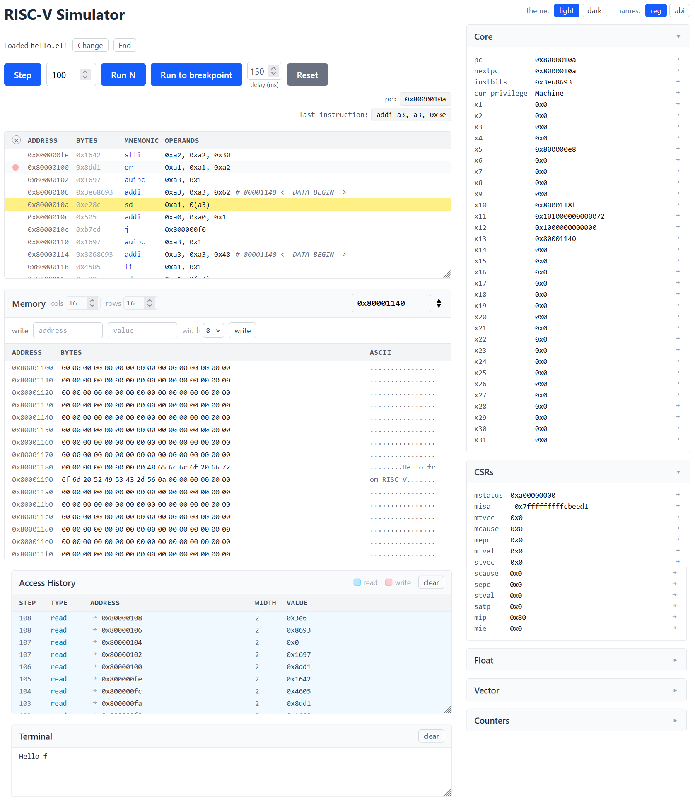

# PyDroGUI

A web interface for the [Pydrofoil](https://github.com/pydrofoil/pydrofoil) RISC-V simulator. 



## Running

Requires Docker.

```bash
docker compose up --build
```

Open <http://localhost:8000>. API reference at `/docs`.
